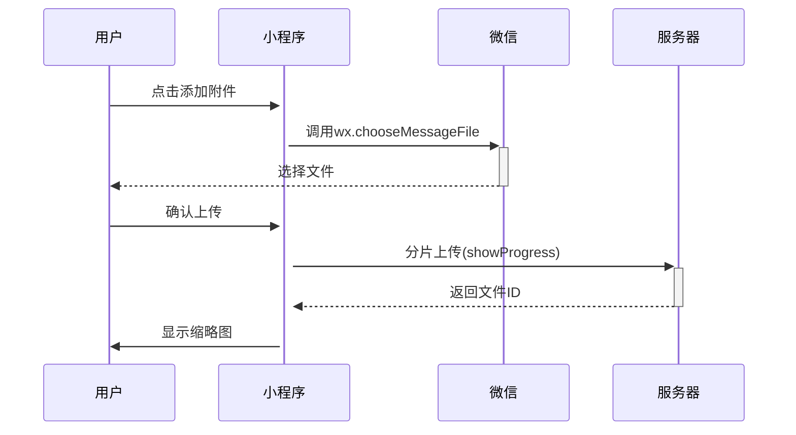

以下是微信小程序端的详细页面设计方案，包含核心功能视图和交互逻辑：

---
### **1. 小程序整体架构**
```bash
pages/
├── home/                # 首页
├── contract/            # 合同相关
│   ├── list             # 合同列表
│   ├── detail           # 合同详情
│   └── sign             # 签署页面
├── auth/                # 认证相关
│   ├── personal         # 个人认证
│   └── enterprise       # 企业认证
└── me/                  # 个人中心
```

---

### **2. 核心页面设计**

#### **2.1 合同列表页 (`contract/list`)**
![列表页示意]
- **顶部Tab栏**：
  - 全部 | 待签署 | 已完成 | 已拒签 
- **筛选条件**：
  - 时间筛选（默认最近3个月）
  - 关键词搜索框
- **列表项设计**：
  - 合同标题（突出显示）
  - 合同状态标签（不同颜色区分）
  - 对方名称/企业logo
  - 截止时间（红色标注逾期）
- **批量操作入口**（仅企业用户可见）

**交互逻辑**：
- 下拉刷新列表
- 点击列表项进入详情页
- 左滑显示"催签"按钮（对未签署合同）

---

#### **2.2 合同详情页 (`contract/detail`)**
![详情页示意]
**上半区（合同信息）**：
- 合同标题 + 合同编号
- 双方身份卡片（带企业认证标）
- 状态进度条（创建→发送→签署→完成）
- 重要时间戳（创建/过期时间）

**下半区（操作区）**：
1. **附件查看模块**
   - 缩略图网格布局（图片/PDF/视频icon）
   - 点击预览大图/播放视频

2. **签署状态面板**
   - 分角色显示签署状态（例：甲方：已签 | 乙方：待签）
   - 签名/公章预览图

3. **操作按钮组**：
   - 待签署合同：显示【立即签署】主按钮
   - 已签署合同：显示【下载合同】【查看存证】
   - 企业用户额外显示【转发签署】按钮

---

#### **2.3 签署页面 (`contract/sign`)**
![签署页示意]
**三步骤引导**：
1. **身份验证**
   - 人脸识别（调用微信原生API）
   - 活体检测动效

2. **签署方式选择**
   - Tab切换：手写签名 | 电子公章
   - 签名板：压感笔迹效果
   - 公章选择：企业用户显示公章库

3. **确认签署**
   - 合同关键信息摘要（防篡改提示）
   - 签署位置预览（自动定位签名区）

**安全措施**：
- 每次签署生成水印（含用户ID+时间戳）
- 禁止截图提示（使用`wx.setVisualEffectOnCapture`）

---

### **3. 关键交互细节**

#### **3.1 附件上传流程**


#### **3.2 批量签署方案**
- **企业管理员**：
  1. 列表页进入多选模式
  2. 选择需要批量发送的合同
  3. 系统自动跳过已实名成员
  4. 生成批量签署任务看板

---

### **4. 视觉设计规范**
- **配色方案**：
  - 主色：`#1890FF`（Ant Design蓝）
  - 辅助色：`#13C2C2`（青蓝）
  - 警示色：`#F5222D`（红色）

- **TDesign组件**：
  - 使用`td-action-sheet`实现底部操作栏
  - `td-steps`展示签署进度
  - `td-upload`改造为附件上传组件

---

### **5. 需要特别注意的边界情况**
1. **超大附件处理**：
   - 超过50MB文件提示"建议使用Web端上传"
2. **签署冲突**：
   - 多人同时签署时采用乐观锁机制
3. **离线状态**：
   - 本地缓存待签署合同基础信息

